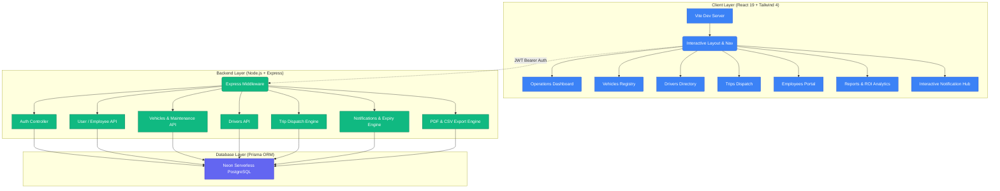

# 🚛 TransitOps — Smart Transport Operations Platform
> **Enterprise-grade fleet logistics, driver safety, dispatch lifecycle, and real-time operations analytics.**

[](https://react.dev/)
[](https://tailwindcss.com/)
[](https://nodejs.org/)
[](https://www.prisma.io/)
[](https://jwt.io/)

TransitOps is a state-of-the-art, full-stack logistics management platform engineered to digitize end-to-end transport operations. It delivers unified control over vehicle registration, maintenance schedules, compliance-first driver scoring, interactive dispatches, and cost logging—empowering fleet operations with automated rules and real-time business insights.

---

## 🏗️ System Architecture

TransitOps is structured into isolated, decoupled layers to ensure horizontal scalability, security, and consistent data transactions.



---

## 🌟 Core Enterprise Features

### 1. 📊 Operations Dashboard & KPIs
- Real-time display of critical operational metrics (Active Vehicles, Available Fleets, In Maintenance, Active/Pending Trips, Drivers On Duty).
- **Fleet Utilization Metrics**: Dynamically calculated percentage based on active vs. registered fleets (excluding retired assets).
- **Fleet Status Breakdown Chart**: Interactive status visualizer using Recharts.

### 2. 🗂️ Employee Registry & Role-Specific Fields
- **Admin-Controlled Additions**: Only Fleet Managers can register new users and assign role profiles.
- **Job Role Contextual Forms**: Dynamic frontend validation switches fields based on role:
  - **Drivers**: Prompts for License Number, Category (A, B, C, B+C, C+E), and Expiry Date. Automatically creates a linked record in the `Driver` table.
  - **Safety Officers**: Prompts for Safety Certification Number and Assigned Region.
  - **Financial Analysts**: Prompts for Employee ID and Cost Department.
- **Secure Logins**: Newly added accounts are hashed (using `bcryptjs`) and can immediately authenticate into the platform.

### 3. 🔔 Interactive Notification Hub
- **Real-Time Polling**: Visual Bell indicator updates dynamically with unread counts.
- **Interactive Trip Approvals**: Drivers receive actionable alerts for new trip assignments and can click **Approve** (which dispatches the trip) or **Reject** (which cancels the trip) directly from the notification dropdown or the Trips page.
- **Automated Expiry Sweeper**: Automatically checks for expired licenses or those expiring in < 30 days. Triggers alert notifications targeted to the driver and broadcasts warnings to all Fleet Managers.
- **Action Logs**: Automatically logs actions on employee updates, driver additions, and trip transitions.

### 4. 🗺️ Strict Dispatch Workflow & Asset Locking
- **Trip Lifecycle States**: Transitions cleanly through `DRAFT` $\rightarrow$ `DISPATCHED` $\rightarrow$ `COMPLETED` or `CANCELLED`.
- **Status Locking**: Dispatching a trip locks both the vehicle and driver status to `ON_TRIP`, blocking them from other assignments.
- **Trip Completion Data**: Collects final odometer readings, fuel consumption, and actual distances on trip completion, auto-logging expense logs and resetting assets to `AVAILABLE`.

### 5. 🛠️ Maintenance Schedules & Cost Control
- **Assets Isolation**: Putting a vehicle in maintenance sets its status to `IN_SHOP`, excluding it from dispatch pools.
- **Expense Correlation**: Captures maintenance costs and descriptions, automatically feeding them into the vehicle's operational cost.

### 6. 📈 Financial Analytics & Export Engine
- **Vehicle ROI Formulas**: ROI is dynamically tracked via:
  $$\text{ROI} = \frac{\text{Revenue} - \text{Operational Cost}}{\text{Acquisition Cost}} \times 100$$
- **Automatic Expense Logging**: Integrates fuel consumption logs (calculated based on real-time price per liter) and toll costs directly into analytics.
- **Exporters**: One-click downloads for fleet-wide CSV spreadsheets, global PDF reports, and vehicle-specific booklets.

---

## 🔒 Security & Role Permissions Matrix

The platform enforces strict Role-Based Access Control (RBAC) at both the routing level (React Router) and the API level (Express Middlewares).

| Feature / Resource | Fleet Manager | Safety Officer | Financial Analyst | Driver |
|:---|:---:|:---:|:---:|:---:|
| **Dashboard** | View | View | View | View |
| **Vehicles Registry** | CRUD | View | View | View |
| **Driver Profiles** | CRUD | Update / Suspend | View | View |
| **Trip Dispatch** | CRUD | View | View | View / Approve / Cancel |
| **Maintenance Logs** | CRUD | View | CRUD | View |
| **Expense Logs** | CRUD | View | CRUD | CRUD (own trips) |
| **Add Employees Page** | CRUD | None | None | None |
| **Operational Reports** | View / Export | None | View / Export | None |

---

## ⚡ Business Rules Engine (Backend Enforced)

TransitOps features a strict validation engine that ensures operational compliance:
* 🚫 **Expired Licenses**: Drivers with expired or expiring licenses cannot be dispatched on trips.
* 🚫 **Suspended Assets**: Drivers or Vehicles marked `SUSPENDED` or `IN_SHOP` are excluded from the dispatch selection pool.
* 🚫 **Overload Prevention**: Checks cargo weight against the vehicle's maximum load capacity to block overloaded dispatches.
* 🚫 **Double Booking**: Asserts that vehicles/drivers currently `ON_TRIP` cannot be added to new trips.

---

## 🚀 Getting Started

### Prerequisites
* [Node.js](https://nodejs.org/) v18+
* [Docker Desktop](https://www.docker.com/products/docker-desktop/) (for starting local PostgreSQL container, if desired)

### Setup & Run (One Command)

TransitOps is equipped with automation scripts to handle installation, database migrations, seeding, and dev server launches:

1. **Install and Setup Environment**:
   Clone the repository, verify that Docker is running, and execute the root setup script:
   ```bash
   # Installs dependencies, spins up Docker PG, runs migrations & seeds the database
   npm run setup
   ```

2. **Launch Dev Servers**:
   Run both dev servers concurrently (express backend on port `5000` and Vite frontend on port `5173`):
   ```bash
   # In terminal 1:
   npm run dev:backend

   # In terminal 2:
   npm run dev:frontend
   ```

3. **Database Maintenance Commands**:
   If you modify schemas or need to reset the schema cache:
   ```bash
   # Sync schema migrations
   npm run db:push --prefix backend
   
   # Re-generate Prisma Client
   npm run db:generate --prefix backend

   # Seed database
   npm run db:seed --prefix backend
   ```

---

## 🔑 Default Credentials (Seeded Demo Accounts)

| Profile | Email Address | Password | Profile Scope |
|:---|:---|:---|:---|
| **Fleet Manager** | `fleet@transitops.com` | `password123` | Full access, user directory, PDF exports |
| **Driver** | `driver@transitops.com` | `password123` | Trip logs, assignment approvals, fuel logs |
| **Safety Officer** | `safety@transitops.com` | `password123` | Driver compliance, license monitoring |
| **Financial Analyst** | `finance@transitops.com` | `password123` | Operational costs, ROI charts, expense entries |

---

## 📁 Project Structure

```
├── backend/
│   ├── prisma/
│   │   ├── schema.prisma        # Database tables & constraints
│   │   └── seed.js              # Seed data for demo accounts/fleets
│   └── src/
│       ├── middleware/          # JWT authorization & roles filter
│       ├── routes/              # Express API handlers
│       ├── utils/
│       │   ├── rules.js         # Compliance validations
│       │   └── notificationHelper.js # License expiry & alert creators
│       └── index.js             # API entrypoint
├── frontend/
│   ├── src/
│   │   ├── components/          # Layout sidebar, notifications menu, UI kits
│   │   ├── context/             # Auth & Theme (Dark Mode) states
│   │   ├── lib/
│   │   │   ├── api.js           # Axios interceptors
│   │   │   └── permissions.js   # Client RBAC mappings
│   │   └── pages/               # Views (Dashboard, Drivers, Trips, etc.)
│   └── vite.config.js           # Vite server configuration
└── docker-compose.yml           # PostgreSQL container setup
```

---

## 🛡️ API Endpoints

### Authentication & Users
* `POST /api/auth/login` - Authenticate account and receive JWT.
* `GET /api/auth/me` - Fetch details of logged-in user.
* `GET /api/users` - Get registered employee directory (Admin only).
* `POST /api/users` - Register a new employee with dynamic profile attributes (Admin only).
* `DELETE /api/users/:id` - Delete an employee account (Admin only).

### Vehicles & Maintenance
* `GET/POST /api/vehicles` - List available vehicles or register a new vehicle.
* `GET/POST /api/maintenance` - View logs or put a vehicle in maintenance (`IN_SHOP`).
* `POST /api/maintenance/:id/close` - Complete maintenance and return vehicle to `AVAILABLE`.

### Drivers
* `GET/POST /api/drivers` - List drivers or add driver details.
* `PUT /api/drivers/:id` - Modify driver fields, contact numbers, or toggle suspensions.

### Trips & Dispatch Lifecycle
* `GET/POST /api/trips` - Query trips list or register a draft trip.
* `POST /api/trips/:id/dispatch` - Transition trip to `DISPATCHED`.
* `POST /api/trips/:id/complete` - Log final parameters and mark trip as `COMPLETED`.
* `POST /api/trips/:id/cancel` - Cancel trip and free associated assets.

### Notifications
* `GET /api/notifications` - Fetch notification history and trigger license warning checks.
* `POST /api/notifications/read-all` - Clear unread counts for all notifications.
* `POST /api/notifications/:id/read` - Mark a single alert as read.
* `POST /api/notifications/:id/action` - Submit trip assignment decisions (`APPROVE` or `CANCEL`).

---

**Built by ODOO Hackathon Team 5star — VR 2026**
